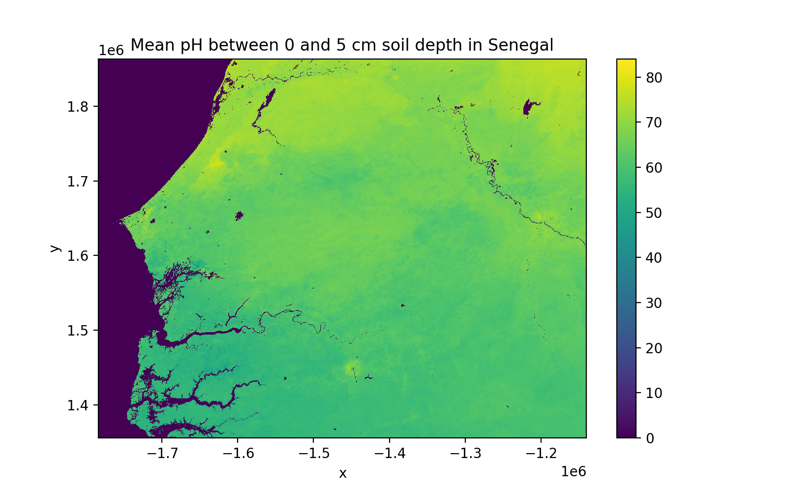

`soilgrids package <https://github.com/gantian127/soilgrids>`_ provides a set of functions that allow downloading of
the global gridded soil information from `SoilGrids <https://www.isric.org/explore/soilgrids>`_,
a system for global digital soil mapping to map the spatial distribution of soil properties across the globe.

soilgrids package includes a `Basic Model Interface (BMI) <https://bmi.readthedocs.io/en/latest/>`_,
which converts the SoilGrids dataset into a reusable,
plug-and-play data component (`pymt_soilgrids <https://pymt-soilgrids.readthedocs.io/>`_) for
the `PyMT <https://pymt.readthedocs.io/en/latest/?badge=latest>`_ modeling framework developed
by Community Surface Dynamics Modeling System (`CSDMS <https://csdms.colorado.edu/wiki/Main_Page>`_)

Getting Started
===============

Installation
++++++++++++

**Stable Release**

The soilgrids package and its dependencies can be installed with pip

.. code-block:: console

    $ pip install soilgrids

or with conda.

.. code-block:: console

    $ conda install -c conda-forge soilgrids

**From Source**

After downloading the source code, run the following command from top-level folder
(the one that contains setup.py) to install soilgrids.

.. code-block:: console

    $ pip install -e .

Download SoilGrids Data
++++++++++++++++++++++++

You can launch binder to test and run the code below. |binder|

**Example 1**: use SoilGrids class to download data (Recommended method)

.. code-block:: python

    import matplotlib.pyplot as plt
    from soilgrids import SoilGrids

    # get data from SoilGrids
    soil_grids = SoilGrids()
    data = soil_grids.get_coverage_data(service_id='phh2o', coverage_id='phh2o_0-5cm_mean',
                                           west=-1784000, south=1356000, east=-1140000, north=1863000,
                                           crs='urn:ogc:def:crs:EPSG::152160',output='test.tif')

    # show metadata
    for key, value in soil_grids.metadata.items():
        print('{}: {}'.format(key,value))

    # plot data
    data.plot(figsize=(9,5))
    plt.title('Mean pH between 0 and 5 cm soil depth in Senegal')

|tif_plot|

**Example 2**: use BmiSoilGrids class to download data (Demonstration of how to use BMI).

.. code-block:: python

    import matplotlib.pyplot as plt
    import numpy as np

    from soilgrids import BmiSoilGrids

    # initiate a data component
    data_comp = BmiSoilGrids()
    data_comp.initialize('config_file.yaml')

    # get variable info
    var_name = data_comp.get_output_var_names()[0]
    var_unit = data_comp.get_var_units(var_name)
    var_location = data_comp.get_var_location(var_name)
    var_type = data_comp.get_var_type(var_name)
    var_grid = data_comp.get_var_grid(var_name)
    print('variable_name: {} \nvar_unit: {} \nvar_location: {} \nvar_type: {} \nvar_grid: {}'.format(
        var_name, var_unit, var_location, var_type, var_grid))

    # get variable grid info
    grid_rank = data_comp.get_grid_rank(var_grid)

    grid_size = data_comp.get_grid_size(var_grid)

    grid_shape = np.empty(grid_rank, int)
    data_comp.get_grid_shape(var_grid, grid_shape)

    grid_spacing = np.empty(grid_rank)
    data_comp.get_grid_spacing(var_grid, grid_spacing)

    grid_origin = np.empty(grid_rank)
    data_comp.get_grid_origin(var_grid, grid_origin)

    print('grid_rank: {} \ngrid_size: {} \ngrid_shape: {} \ngrid_spacing: {} \ngrid_origin: {}'.format(
        grid_rank, grid_size, grid_shape, grid_spacing, grid_origin))

    # get variable data
    data = np.empty(grid_size, var_type)
    data_comp.get_value(var_name, data)
    data_2D = data.reshape(grid_shape)

    # get X, Y extent for plot
    min_y, min_x = grid_origin
    max_y = min_y + grid_spacing[0]*(grid_shape[0]-1)
    max_x = min_x + grid_spacing[1]*(grid_shape[1]-1)
    dy = grid_spacing[0]/2
    dx = grid_spacing[1]/2
    extent = [min_x - dx, max_x + dx, min_y - dy, max_y + dy]

    # plot data
    fig, ax = plt.subplots(1,1, figsize=(9,5))
    im = ax.imshow(data_2D, extent=extent)
    fig.colorbar(im)
    plt.xlabel('X')
    plt.ylabel('Y')
    plt.title('Mean pH between 0 and 5 cm soil depth in Senegal')

Parameter settings
+++++++++++++++++++
"get_coverage_data()" method includes multiple parameters for data download. Details for each parameter are listed below.

* **service_id**: The identifier of each map service provided by the SoilGrids system. The supported service id and the
  corresponding variable names are shown below. The "map_services" attribute of an instance will show more
  detailed information.

  * bdod: Bulk density
  * cec: Citation exchange capacity at ph7
  * cfvo: Coarse fragments volumetric
  * clay: Clay content
  * nitrogen: Nitrogen
  * phh2o: Soil pH in H2O
  * sand: Sand content
  * silt: Silt content
  * soc: Soil organic carbon content
  * ocs: Soil organic carbon stock
  * ocd: Organic carbon densities

* **coverage_id**: The identifier of a coverage(map) from a map service. Each map service supports
  multiple coverages. To get a list of the coverage id from a map service, use "get_coverage_list()" method.
  To learn the meaning of the coverage id, please visit the SoilGrids `FAQ page <https://www.isric.org/explore/soilgrids>`_

* **crs**: the coordinate system code of a coverage. To get the supported crs code list of a coverage, use "get_coverage_info()" method.

* **west, south, east, north**: The bounding box values for the downloaded data. These values should be based on the
  coordinate system specified by the "crs" parameter. The west and south values are for the point on the lower left corner
  of the bounding box. The east and north values are for the point on the upper right corner of the bounding box.

* **output**: The file path of the GeoTiff file to store the downloaded data with ".tif" file extension.

* **resx, resy**: The grid resolution for the downloaded data when "crs" parameter is set as a
  projection coordinate system(e.g., epsg 152160). The default value for resx and resy is set as 250 (m) if not
  specified by the user. This is the same grid resolution as the soil datasets in the SoilGrids system.
  The resx and resy parameters are required when the "crs" parameter is set as a projection coordinate system
  and the width and height values are not needed.

* **width, height**: The width and height of the raster for the downloaded data when "crs" parameter is set as a
  geographic coordinate system(e.g., epsg 4326 for WGS84). The height represents the number of rows and the width
  represents the number of columns for the raster grid of the downloaded data. The width and height parameters
  are required when the "crs" is set as a geographic coordinate system and resx and resy values are not needed.

* **response_crs**: the coordinate system code for the GeoTiff file of the downloaded data. If response_crs is not
  specified by the user, its value will be the same as the crs value.

* **local_file**: indicate whether to make it priority to get the data by loading a local file that matches with the
  output file path. Default value is set as False, which means the function will directly download the data from SoilGrids
  system. If value is set as True, the function will first try to open a local file that matches with
  the output file path. And if the local file doesn't exist, it will then download data from SoilGrids.

.. links:

.. |binder| image:: https://mybinder.org/badge_logo.svg
 :target: https://mybinder.org/v2/gh/gantian127/soilgrids/master?filepath=notebooks%2Fsoilgrids.ipynb

